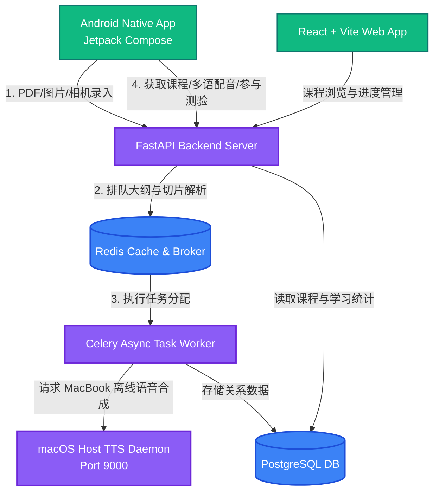

# 粤语智能学习平台 (Cantonese Language Learning Platform)

这是一个基于 AI 驱动的现代化粤语多端智能学习系统。通过 **Gemini 2.5 Flash** 智能规划教材大纲，配合**本地高音质离线多发言人语音合成系统 (TTS)**，实现教材的即时导入、课件与高保真发音生成、多维度趣味智能评测（多选、听力连线、拼句、情境对话等），为粤语学习者提供沉浸式的互动体验。

---

## 🏗️ 架构图与技术栈 (Architecture & Technology Stack)



### 📱 移动客户端 (Android Client)
- **UI 框架**：Jetpack Compose (现代化声明式 UI)
- **设计系统**：Obsidian 暗黑奢华主题，结合 `MintGreen` 与 `GlowGold` 微动态动画，Duolingo 式答题反馈滑出面板（已针对夜间学习进行**低眩光深色反馈面板优化**）。
- **核心功能**：
  - **教材多源录入**：支持 PDF 电子书直接导入、相册多张照片无损上传、**相机逐页拍照录入向导** (Client-side PDF 零拷贝合集)。
  - **无线一键配置**：支持 Settings 弹窗内直接更改 Host IP 地址，Retrofit 自动重构 Lazy Service，实现零布线测试。
  - **高还原连线卡片**：支持 Jyutping/中文连线及**聆听卡片连线 (仅音量喇叭)**。
  - **教材元数据编辑器**：书架卡片新增 ✏️ **一键编辑**按钮，支持直接修改课本标题、简介、源/目标语言，并支持**相册封面自选替换**（内置 Cover 缓存戳自动刷新算法，零延迟渲染）。
  - **极光智能复习房 (Smart Review Suite)**：基于已学单元自动解锁的极光玻璃态 HUD 控制台，支持**“闪卡速记” (Flashcard Sprint)** 以及 **“智能挑战” (Randomized Mastery Quiz)**，零代码冗余设计，一键混打温故知新。

### ⚙️ 后端系统 (FastAPI Server & Celery)
- **Web 框架**：FastAPI (高性能异步 Python 框架)
- **任务队列**：Celery + Redis (多级任务流解耦)
- **数据库**：SQLAlchemy + PostgreSQL
- **图片预处理**：Pillow (服务端自动将上传图片合成为 PDF 统一交由任务流解析)

### 🎙️ 语音微服务 (macOS Host TTS Daemon)
- **TTS 引擎**：集成在线 Edge-TTS 及本地 MacBook Apple Silicon 离线语音 (`say` 引擎)
- **随机多发言人**：自动检索系统内 `zh_HK` 粤语配音包 (Aasing, Fung, Wing, Sinji 等)，实现多语境男女声随机发音。
- **媒体重编码**：集成 `ffmpeg`，自动将 macOS 导出的 `.caf` ALAC 高保真音频重编码为高兼容性 AAC-LC `.m4a` 音频流，保障 Android 播放兼容性。

---

## ⚡ 核心功能特性 (Key Features)

1. **教材一键智能切片**：上传 PDF 或连拍多张图片后，Gemini 自动解析整本教材的大纲、章节名称、起始页码，后台进行段落提取，自动划分词汇重点、语法要点。
2. **Spaced-Repetition 动态生成测验**：测验不使用静态库，而是根据用户所选 Unit 的词汇特征，即时动态生成 10 题测验，随机分布听力拼写、喇叭音量连线、Emoji 卡片 2x2 选择、系统插图情境对话。
3. **MacBook Apple Silicon 本地高兼容语音**：离线模式下 100% 运行于 host 本地，不消耗 API Key 额度，且音频自动进行 AAC 兼容性编码，响应速度极快。
4. **无线/零走线真机调试**：提供 SharedPreferences 自动持久化 IP 的无线连接方案，免受 USB 接口和动态 DHCP 的干扰。

---

## 🚀 快速开始 (Getting Started)

### 1. 本地 macOS 语音微服务启动
在您的 MacBook (Host) 上运行本地语音微服务（用于离线高保真粤语合成）：
```bash
cd host_service
chmod +x start_host_tts.sh
./start_host_tts.sh
```
服务将在本地 `http://localhost:9000` 启动守护进程。

### 2. 后端 Docker 容器启动
在 `/server` 目录下启动 API 与异步 Celery Worker：
```bash
cd server
# 创建本地配置文件
cp .env.example .env # 请填写您的 GEMINI_API_KEY 与 vertex_credentials.json 路径
# 启动数据库与容器集群
docker-compose up -d --build
```

### 3. React Web 进度面板启动
在 `/web` 目录下启动管理面板：
```bash
cd web
npm install
npm run dev
```

### 4. Android 真机编译与无线运行
确认您的手机与 Mac 处于同一 Wi-Fi 网段下：
```bash
cd android
./gradlew installDebug
```
安装完成后，在 Android App 右上角点击 **设置 (Settings)** 齿轮，输入您 Mac 在无线局域网下的 `IP:Port` (例如 `192.168.31.146:8001`) 并保存，系统将自动发起同步数据，无需额外布线。
